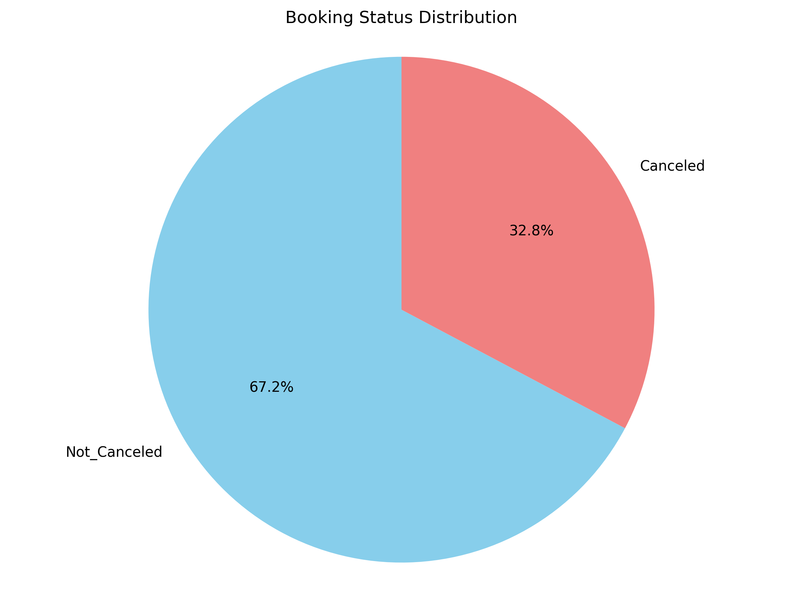
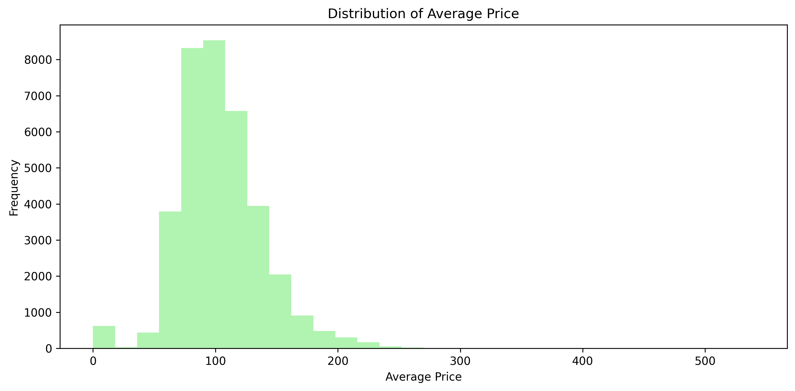
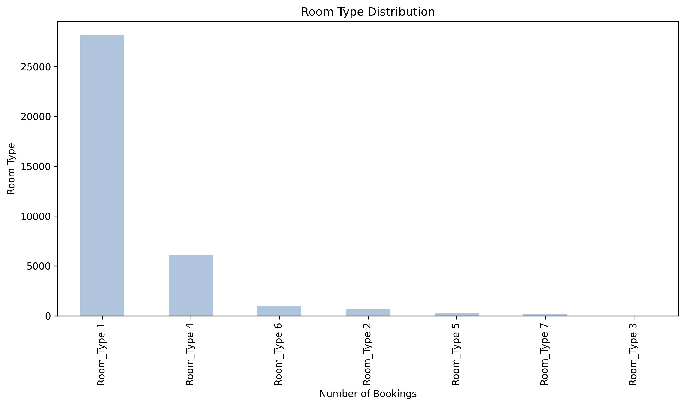
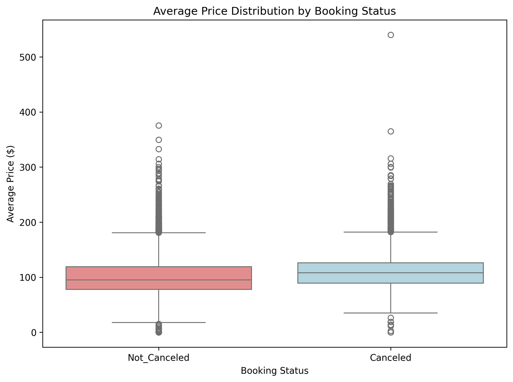
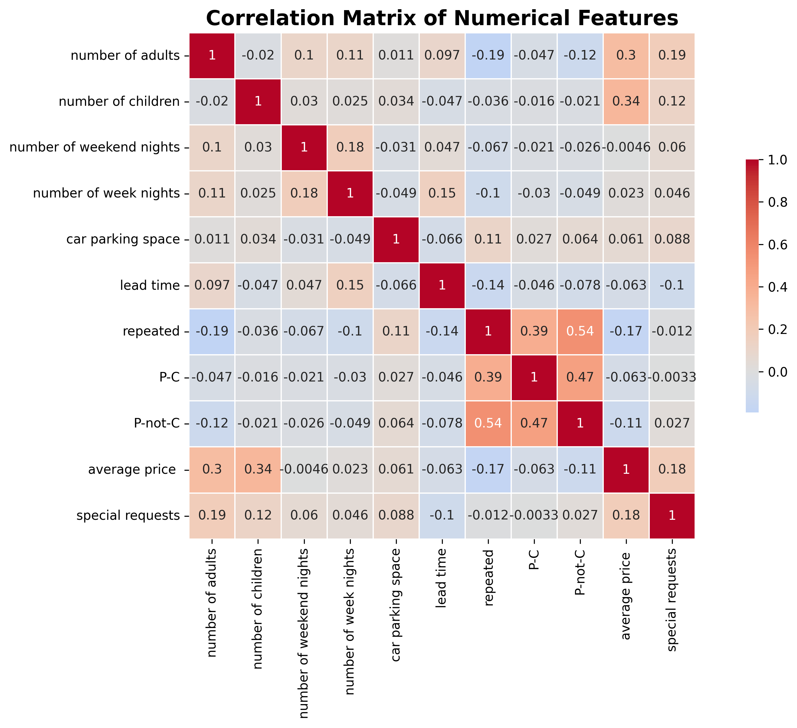
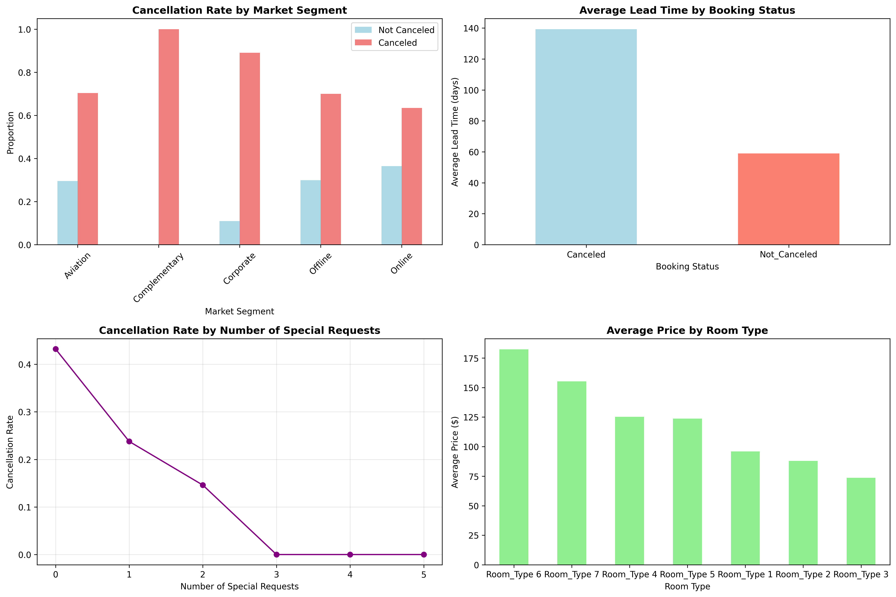

# Hotel Booking Data Analysis 🏨📊

A comprehensive exploratory data analysis (EDA) of hotel booking data to understand booking patterns, customer behavior, and factors affecting booking cancellations.

## 📁 Project Overview

This project analyzes hotel booking data to uncover insights about:
- Booking cancellation patterns
- Customer demographics and preferences  
- Pricing trends and market segments
- Seasonal booking patterns
- Room type preferences

## 🎯 Key Findings

### Booking Status Distribution

- **67.2%** of bookings are confirmed (Not Canceled)
- **32.8%** of bookings are canceled
- High cancellation rate indicates need for better booking policies

### Price Analysis

- Average price: **$103.42**
- Price range: $0.00 - $540.00
- Most bookings fall in the $50-$150 range

### Room Type Preferences

- **Room Type 1** dominates with 77.5% of all bookings
- **Room Type 4** is second most popular with 16.7%
- Clear preference for standard room types

### Price vs Booking Status

- Canceled bookings show similar price distribution to confirmed bookings
- Price alone doesn't appear to be the main factor in cancellations

### Feature Correlations

- Strong correlations between P-C and P-not-C variables (related to booking outcome)
- Moderate correlation between weekend and week nights
- Lead time shows interesting patterns with other features

### Business Intelligence Dashboard

Key insights from the dashboard:
- **Complementary market segment** has 100% cancellation rate
- **Canceled bookings** have significantly higher lead times (139 days vs 59 days)
- **Special requests** correlate inversely with cancellation rates
- **Room Type 6** commands the highest average price

## 📊 Dataset Information

- **Total Records**: 36,285 hotel bookings
- **Features**: 16 attributes including customer details, booking information, and hotel features
- **Time Period**: Historical booking data
- **Target Variable**: Booking Status (Canceled/Not_Canceled)

### Key Features Analyzed:
- `booking status` - Whether booking was canceled or confirmed
- `average price` - Average daily rate for the booking
- `lead time` - Days between booking date and arrival
- `room type` - Type of room booked
- `market segment type` - Market segment designation
- `number of adults/children` - Guest composition
- `special requests` - Number of special requests made
- `repeated` - Whether customer is repeat visitor

## 🔧 Technologies Used

- **Python 3.11+**
- **Pandas** - Data manipulation and analysis
- **NumPy** - Numerical computations
- **Matplotlib** - Data visualization
- **Seaborn** - Statistical data visualization
- **Jupyter Notebook** - Interactive development environment

## 📈 Analysis Highlights

### Customer Insights
- Most bookings are for 2 adults with no children
- Very few repeat customers in the dataset
- Online Travel Agents are the dominant market segment

### Booking Patterns
- Higher lead times may correlate with higher cancellation rates
- Market segment affects booking behavior
- Room type preferences are heavily skewed toward standard rooms

### Business Implications
- **Revenue Impact**: 32.8% cancellation rate represents significant potential revenue loss
- **Pricing Strategy**: Current pricing structure shows wide distribution
- **Customer Retention**: Low repeat customer rate suggests opportunities for loyalty programs
- **Room Management**: Heavy preference for Room Type 1 may indicate need for capacity optimization

## 🚀 Getting Started

### Prerequisites
```bash
pip install pandas numpy matplotlib seaborn jupyter
```

### Running the Analysis
1. Clone this repository
2. Install required dependencies
3. Place your hotel booking dataset as `Hotel_Booking.csv` in the project directory
4. Run the Jupyter notebook: `Exploratory_Data_Analysis_Hotel_Booking.ipynb`

### Dataset Structure
The analysis expects a CSV file with the following key columns:
- booking_status
- average_price
- lead_time
- room_type
- market_segment_type
- number_of_adults
- number_of_children
- special_requests
- repeated

## 📁 Project Structure
```
Hotel_Booking_EDA/
├── README.md
├── Exploratory_Data_Analysis_Hotel_Booking.ipynb
├── images/
│   ├── booking_status_distribution.png
│   ├── price_distribution.png
│   ├── room_type_distribution.png
│   ├── price_by_booking_status.png
│   ├── correlation_heatmap.png
│   └── business_insights_dashboard.png
└── requirements.txt
```

## 📝 Future Work

- **Predictive Modeling**: Build machine learning models to predict booking cancellations
- **Time Series Analysis**: Analyze seasonal trends and booking patterns over time
- **Customer Segmentation**: Advanced clustering analysis for better customer understanding
- **Feature Engineering**: Create new features from existing data for deeper insights
- **A/B Testing Framework**: Design experiments to test booking policy changes

## 🤝 Contributing

Feel free to fork this project and submit pull requests for any improvements or additional analysis you'd like to add!

## 📧 Contact

Created by [Moaz Mohamed](https://github.com/moazmo) - feel free to contact me!

---

⭐ If you found this analysis helpful, please give it a star!
